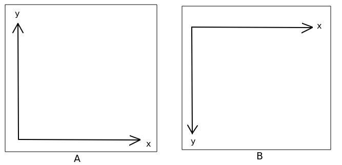
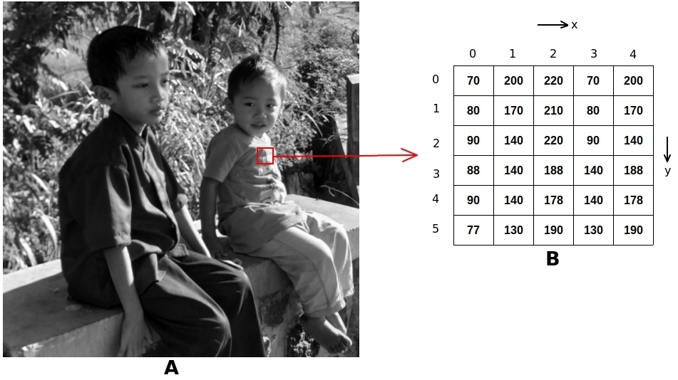

[Kembali ke halaman utama](../README.md)

#### Definisi Singkat dari Citra
Sebelum terjun ke materi, kita kenalan dulu dengan apa yang disebut **citra**. Mungkin, kalian bertanya-tanya, kenapa ***image*** ketika diterjemahkan ke dalam bahasa Indonesia menjadi citra? Kenapa terjemahannya bukan gambar? *Well*, citra secara makna memiliki konteks yang lebih luas dibandingkan dengan gambar. Sederhananya, gambar itu merupakan bagian dari citra. Contohnya, citra 2 dimensi (2D) bisa kalian temukan pada foto digital yang biasa kalian ambil dengan kamera, citra 3 dimensi seperti pada model objek 3 dimensi dari AutoCAD, dan sebagainya. Selanjutanya dalam materi ini, istilah **citra 2D** saya sederhanakan menjadi **citra**. Artinya, setiap ada kata **citra** berarti citra 2D.

#### Model dari Citra
Teman-teman yang telah mengambil mata kuliah Aljabar Linier (AL) masih ingat kan dengan beberapa fungsi matematis dan matriks? Di dalam mata kuliah AL, kalian belajar tentang matriks dua dimensi (2D). Coba kalian bayangkan sebuah citra dalam bentuk matriks 2D. Sulit gak? Oke, kita ilustrasikan fungsi tersebut ke dalam bentuk fungsi . Sehingga, didapat matriks pada Persamaan 1:  

<table>
<tr>
<td>  

%20%3D%20%20%5Cbegin%7Bbmatrix%7D%20x_0y_0%20%26%20x_1y_0%20%26%20%5Ccdots%20%26%20x_ny_0%20%5C%5C%20%20x_0y_1%20%26%20x_1y_1%20%26%20%5Ccdots%20%26%20x_ny_1%20%5C%5C%20%5Cvdots%20%26%20%5Cvdots%20%26%20%5Cvdots%20%26%20%5Cvdots%20%5C%5C%20x_0y_n%20%26%20x_1y_1%20%26%20%5Ccdots%20%26%20x_ny_n%20%5C%5C%20%5Cend%7Bbmatrix%7D%20%24) 

</td>
<td>

*Persamaan 1* 

</td>
</tr>
</table>

Tenang, tidak perlu panik. Kita bedah rumus pada Persamaan 1 ya. Kita ingat kembali bahwa citra pada dasarnya adalah sebuah matriks 2D. Bayangkan matriks 2D dalam bentuk koordinat spasial kartesian dengan sumbu x dan sumbu y. Oiya, yang perlu diingat adalah adanya perbedaan koordinat sumbu (x,y) pada citra dengan koordinat kartesian. Perbedaannya adalah letak titik 0 (nol). Pada citra digital, titik nol berada di atas (Gambar 1A). Sedangkan kartesian berada di bawah (Gambar 1B). Fungsi f(x,y) pada Pers. 1 adalah fungsi **intensitas** pada tiap titik citra. Satuan titik pada citra digital disebut dengan **piksel** (pixel). Nilai intensitas pada tiap piksel memiliki nilai yang sifatnya **diskrit**. Adapun rentang nilai intensitas ini antara **0 hingga 255**.
   
*Gambar 1*. (A) Koordinat Kartesian pada selain citra digital. (B) Koordinat kartesian pada citra digital

Untuk lebih memudahkan pemahaman, kita *crop* sebagian kecil dengan ukuran 5 x 6 piksel dari sebuah citra (Gambar 2A). Kemudian, diilustrasikan besarnya intensitas tiap titik (Gambar 2B).

   
*Gambar 2*. (A) Citra sampel dalam grayscale. (B) Citra hasil *cropping* dari (A) dengan ukuran 5x6 piksel.

Setiap blok pada Gambar 2B berukuran 1 piksel. Setiap piksel memiliki nilai intensitas. Contoh: pada Gambar 2B titik (0,0) memiliki intesitas sebesar 70. Jika ada citra memiliki koordinat x,y serta nilai intensitas yang terbatas dan diskrit maka disebut sebagai **citra digital**. 

