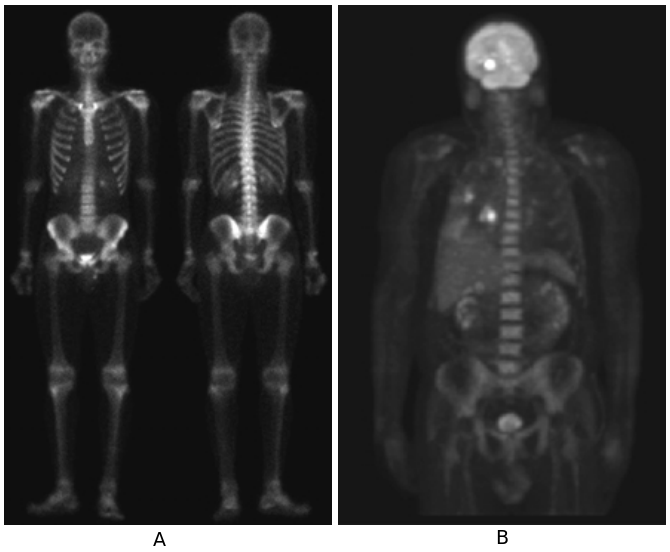

Saat ini, banyak sekali ditemukan contoh dari implementasi PCD dalam kehidupan sehari-hari. Bahkan, sulit rasanya kita lepas dari PCD. Dalam media sosial contohnya: dari bangun tidur, membuka Instagram di **smartphone**, selfie, jepret, buka Facebook pun juga demikian, Snapchat, dan sebagainya. Contoh lain yang tidak kalah penting adalah dalam bidang kesehatan. PCD dalam kesehatan bisa dikatakan mengalami peningkatan secara signifikan. [1](#ref1)  

1. #### Kesehatan ####

   1. Sinar Gamma   
Metode Pencitraan dengan Sinar Gamma atau *Gamma Ray* sudah ditemukan di awal abad 20. Teknologi ini bisa diterapkan pengobatan dengan bahan nuklir. Secara teknis, pengobatan ini dilakukan dengan menyuntik tubuh pasien dengan Isotop Radioaktif. Kemudian, citra dari kamera khusus, yang bisa mendeteksi sinar gamma, dianalisis (Gambar 3). 

       
*Gambar 3*. Pencitraan dengan Sinar Gamma (A) Scan tulang. (B) citra PET. Sumber gambar (A) G.E. Medical Systems, (B) Dr. Michael E. Casey, CTI PET Systems

   1. Sinar X 
    Sinar X adalah salah satu teknologi pemanfaatan gelombang elektromagnetik dalam pencitraan. Alat yang mungkin pernah kalian jumpai adalah Rontgen. 
    
1. #### Media Sosial ####
   1. Pengenalan Wajah di Facebook
   
      Ketika kalian pernah menggunggah foto ke Facebook yang isinya foto kalian dengan beberapa teman atau keluarga, Facebook akan memberikan saran untuk menandai atau *tag* nama teman berdasarkan wajah. Pernah tidak kalian terpikir bagaimana Facebook bisa tahu bahwa itu foto temanmu, kakakmu, atau adikmu? Boro-boro tahu teman, kebayang gak bagaimana Facebook tahu bahwa itu wajah manusia? Teknologi ini disebut dengan **Face Recognition** atau **Pengenalan Wajah**. Teknik ini dibuat berdasarkan penelitian ilmiah yang dipublikasikan di Computer Vision and Pattern Recognition (CVPR) pada tahun 2014 oleh Yaniv Taigman *et al.* dengan judul "DeepFace: Closing the Gap to Human-Level Performance in Face Verification". [4]  
   1. Telinga dan Lidah di Snapchat
   1. Beauty Filter di Instagram
   
1. #### Referensi ####

<a id="ref1">[1]</a> Gonzalez, R., & Woods, R. (2002). Digital image processing. Prentice Hall.

[2](#ref2) Y. Taigman, M. Yang, M. Ranzato and L. Wolf, "DeepFace: Closing the Gap to Human-Level Performance in Face Verification," 2014 IEEE Conference on Computer Vision and Pattern Recognition, Columbus, OH, 2014, pp. 1701-1708, doi: 10.1109/CVPR.2014.220.

[3](#ref3) Viola, P., & Jones, M. (2001). Rapid object detection using a boosted cascade of simple features. In Proceedings of the 2001 IEEE Computer Society Conference on Computer Vision and Pattern Recognition. CVPR 2001 (pp. I–511–I–518). IEEE Comput. Soc.

